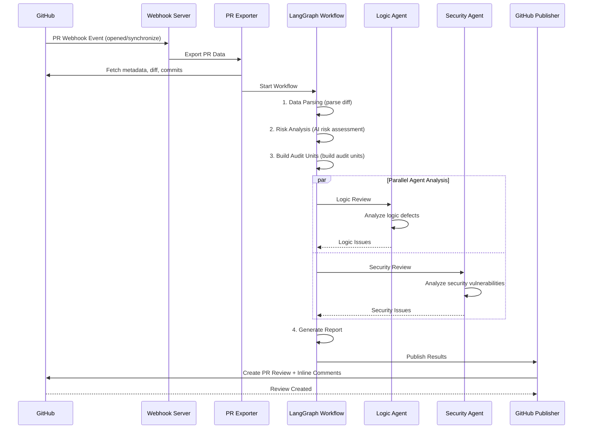

# 🦉 Wise Code Watchers

<p align="center">
  <strong>AI-Powered Multi-Agent PR Code Review System</strong>
</p>


<p align="center">
  
  
  
  
</p>


---

## 📖 Project Overview

**Wise Code Watchers** is an intelligent code review system built on LangGraph's multi-agent architecture. Running as a GitHub App, it automatically performs in-depth code reviews on Pull Requests. The system detects logic defects and security vulnerabilities, publishing review results as inline comments directly in GitHub PRs.

### ✨ Key Features

- 🤖 **Multi-Agent Collaboration Architecture**: LangGraph-based workflow engine with multiple specialized agents working in parallel
- 🔒 **Security Vulnerability Detection**: Professional Security Agent combined with Semgrep rules to detect security vulnerabilities
- 🧠 **Logic Defect Analysis**: Logic Agent performs deep analysis of code logic to uncover potential bugs
- 📊 **Intelligent Risk Assessment**: AI-driven risk scoring system prioritizes high-risk code for review
- 🔗 **Cross-File Analysis**: Analyzes the cross-file impact of code changes
- 💬 **Deep GitHub Integration**: Automatically posts inline comments to PRs with GitHub App Webhook support

---

## 🏗️ System Architecture

```
┌─────────────────────────────────────────────────────────────────────────────┐
│                              Wise Code Watchers                             │
├─────────────────────────────────────────────────────────────────────────────┤
│                                                                              │
│  ┌──────────────┐    ┌──────────────┐    ┌──────────────────────────────┐  │
│  │  GitHub App  │───▶│   Webhook    │───▶│       PR Exporter            │  │
│  │   Webhook    │    │   Handler    │    │  (metadata/diff/commits)     │  │
│  └──────────────┘    └──────────────┘    └──────────────────────────────┘  │
│                                                      │                       │
│                                                      ▼                       │
│  ┌───────────────────────────────────────────────────────────────────────┐  │
│  │                     LangGraph Workflow Engine                          │  │
│  │  ┌─────────────┐  ┌─────────────┐  ┌─────────────┐  ┌─────────────┐   │  │
│  │  │ Data Parse  │─▶│ Risk Analyze│─▶│  Triage    │─▶│  Parallel   │   │  │
│  │  │    Node     │  │    Node     │  │   Node      │  │  Analysis   │   │  │
│  │  └─────────────┘  └─────────────┘  └─────────────┘  └─────────────┘   │  │
│  │                                                            │           │  │
│  │                    ┌─────────────────────┬────────────────┘            │  │
│  │                    ▼                     ▼                               │  │
│  │            ┌──────────────┐      ┌──────────────┐                       │  │
│  │            │ Logic Agent  │      │Security Agent│                       │  │
│  │            │(Logic Review)│      │(Security Review)                     │  │
│  │            └──────────────┘      └──────────────┘                       │  │
│  │                    │                      │                               │  │
│  │                    └──────────┬───────────┘                               │  │
│  │                               ▼                                         │  │
│  │                    ┌──────────────────┐                                  │  │
│  │                    │ Report Generator │                                │  │
│  │                    └──────────────────┘                                │  │
│  └───────────────────────────────────────────────────────────────────────┘  │
│                                        │                                     │
│                                        ▼                                     │
│                         ┌──────────────────────────┐                        │
│                         │    GitHub Publisher      │                        │
│                         │  (PR Comments/Reviews)   │                        │
│                         └──────────────────────────┘                        │
└─────────────────────────────────────────────────────────────────────────────┘
```

---

## 📁 Project Structure

```
wise-code-watchers/
├── app.py                      # 🚀 Main entry point (Flask Webhook Server)
├── config.py                   # ⚙️ Configuration management
├── backup.py                   # 💾 Backup script
├── scan_pr_with_templates.py   # 🔍 PR scanning script
├── requirements.txt            # 📦 Python dependencies
├── Dockerfile                  # 🐳 Docker image configuration
├── docker-compose.yml          # 🐳 Docker Compose configuration
├── .env.example                # 🔐 Environment variables example
├── linter-installation.md      # 📖 Linter installation guide
├── CONTRIBUTING.md             # 🤝 Contributing guide
├── CONTRIBUTORS.md             # 👥 Contributors list
│
├── core/                       # 🔧 Core modules
│   ├── github_client.py        # GitHub API client
│   ├── git_client.py           # Git operations client
│   └── repo_manager.py         # Repository manager
│
├── agents/                     # 🤖 Agent modules
│   ├── __init__.py
│   ├── base.py                 # Agent base class
│   ├── aggregator.py           # Result aggregator
│   ├── orchestrator.py         # Agent orchestrator
│   ├── issue_scoring_filter.py # Issue scoring filter (LLM 3D scoring)
│   ├── summary_agent.py        # Summary agent
│   │
│   ├── preprocessing/          # Preprocessing modules
│   │   ├── diff_parser.py      # Diff parser
│   │   ├── description_analyzer.py # PR description analyzer
│   │   └── feature_divider.py  # Feature divider
│   │
│   ├── syntax/                 # Syntax analysis modules
│   │   ├── syntax_analysis_agent.py  # Syntax analysis agent
│   │   ├── syntax_checker.py         # Syntax checker
│   │   ├── structure_agent.py        # Structure agent
│   │   ├── memory_agent.py           # Memory agent
│   │   ├── issue_filter.py           # Issue filter
│   │   ├── core_rules.py             # Core rules
│   │   ├── schemas.py                # Data schemas
│   │   └── prompts/                  # Prompt templates
│   │       ├── base.py
│   │       ├── python_prompt.py
│   │       ├── java_prompt.py
│   │       ├── go_prompt.py
│   │       ├── ruby_prompt.py
│   │       └── typescript_prompt.py
│   │
│   └── vulnerability/          # 🔒 Vulnerability detection module (core)
│       └── src/
│           ├── main_workflow.py      # 🌟 LangGraph main workflow
│           │
│           ├── agents/               # Agent implementations
│           │   ├── logic_agent.py    # Logic defect agent
│           │   ├── security_agent.py # Security vulnerability agent
│           │   └── triage_agent.py   # Triage pre-screening agent
│           │
│           ├── analysis/             # Analysis engines
│           │   ├── risk_analyzer.py       # Risk analyzer
│           │   ├── cross_file_analyzer.py # Cross-file analyzer
│           │   ├── impact_analyzer.py     # Impact analyzer
│           │   ├── security_validator.py  # Security validator
│           │   └── hunk_index.py          # Hunk index
│           │
│           ├── scripts/             # Utility scripts
│           │   ├── core/
│           │   │   ├── code_tools.py       # Code tools
│           │   │   ├── context_builder.py  # Context builder
│           │   │   └── types.py            # Type definitions
│           │   ├── parsing/
│           │   │   ├── data_parser.py      # Data parser
│           │   │   └── diff_slicer.py      # Diff slicer
│           │   ├── scanning/
│           │   │   ├── parallel_semgrep_scanner.py    # Parallel Semgrep scanner
│           │   │   ├── template_semgrep_scanner.py    # Template Semgrep scanner
│           │   │   ├── scan_task_planner.py           # Scan task planner
│           │   │   └── security_tooling.py            # Security tooling
│           │   ├── reporting/
│           │   │   └── final_report_generator.py      # Final report generator
│           │   ├── todolist/
│           │   │   ├── todolist_generator.py          # TODO list generator
│           │   │   └── todolist_executor.py           # TODO list executor
│           │   ├── analysis/
│           │   │   ├── initialization_engine.py       # Initialization engine
│           │   │   └── vulnerability_analyzer.py      # Vulnerability analyzer
│           │   └── smart_context_builder.py           # Smart context builder
│           │
│           ├── prompts/             # LLM prompts
│           │   └── prompt.py
│           │
│           ├── mcpTools/           # MCP tools integration
│           │   └── mcpTools.py
│           │
│           └── semgrep_rules/      # Semgrep rule templates (36+ templates)
│               └── templates/
│                   ├── c_*.template.yaml              # C language rules
│                   ├── go_*.template.yaml             # Go language rules
│                   ├── java_*.template.yaml           # Java language rules
│                   ├── py_*.template.yaml             # Python language rules
│                   ├── rb_*.template.yaml             # Ruby language rules
│                   └── ts_*.template.yaml             # TypeScript language rules
│
├── tools/                      # 🛠️ External tools integration
│   ├── base.py                 # Tool base class
│   ├── linter.py               # Multi-language Linter (Ruff, ESLint, golangci-lint, etc.)
│   ├── security_scanner.py     # Security scanner (Bandit, pattern matching)
│   └── static_analyzer.py      # Static analyzer
│
├── knowledge/                  # 📚 Knowledge base
│   ├── base.py                 # Knowledge base base class
│   ├── vulnerability_kb.py     # Vulnerability knowledge base
│   ├── code_patterns_kb.py     # Code patterns knowledge base
│   └── best_practices_kb.py    # Best practices knowledge base
│
├── output/                     # 📊 Output modules
│   ├── models.py               # Data models
│   └── report_generator.py     # Report generator
│
├── export/                     # 📤 Export modules
│   └── pr_exporter.py          # PR data exporter (metadata, diff, commits)
│
├── publish/                    # 📢 Publishing modules
│   └── github_publisher.py     # GitHub comment/review publisher
│
├── dev/                        # 🧪 Development/Testing
│   ├── architecture.md         # Architecture documentation
│   ├── test_workflow.py        # Workflow testing
│   └── test_hybrid_agent.py    # Agent testing
│
├── pr_export/                  # 📦 PR export data cache
│   └── Wise-Code-Watchers_*_PR*/
│
├── workspace/                  # 💼 Workspace (repo clone directories)
│   └── discourse-wcw/          # Example: Discourse project
│
└── secret/                     # 🔐 Secret storage
```

---

## 🔄 Workflow

### Complete Review Process



### Workflow Node Details

| Node                   | Function                              | Input                    | Output            |
| ---------------------- | ------------------------------------- | ----------------------- | ----------------- |
| **Initialization**     | Initialize audit units, filter code   | PR directory            | Audit unit list   |
| **Data Parsing**       | Parse PR metadata and diff            | PR folder               | diff_ir, pr_data  |
| **Risk Analysis**      | AI-driven risk assessment             | diff_ir                 | feature_risk_plan |
| **Semgrep Scanning**   | Run security scanning rules           | Codebase                | semgrep_results   |
| **Logic Agent**        | Detect logic defects                  | Audit unit              | logic_review      |
| **Security Agent**     | Detect security vulnerabilities       | Audit unit + Semgrep evidence | security_review   |
| **Cross-File Analysis**| Analyze cross-file impact             | All analysis results    | cross_file_impact |
| **Report Generation**  | Generate final report                 | All analysis results    | final_report      |

---

## 🚀 Quick Start

### Requirements

- Python 3.12+
- Docker (recommended)
- GitHub App configuration

### 1. Clone the Project

```bash
git clone https://github.com/your-org/wise-code-watchers.git
cd wise-code-watchers
```

### 2. Install Dependencies

```bash
# Create virtual environment
python -m venv venv
source venv/bin/activate  # Linux/macOS
# venv\Scripts\activate  # Windows

# Install dependencies
pip install -r requirements.txt
```

### 3. Configure Environment Variables

Create a `.env` file:

```bash
# GitHub App Configuration
GITHUB_APP_ID=your_app_id
GITHUB_PRIVATE_KEY_PATH=/path/to/private-key.pem
GITHUB_WEBHOOK_SECRET=your_webhook_secret

# LLM Configuration
OPENAI_API_KEY=your_openai_api_key
# Or use OpenAI-compatible API
LLM_BASE_URL=https://api.example.com/v1
LLM_MODEL=gpt-4

# Service Configuration
PORT=3000

# Optional: Vulnerability detection thresholds
VULN_RISK_THRESHOLD_LOGIC=60
VULN_RISK_THRESHOLD_SECURITY=35
VULN_MAX_UNITS_LOGIC=12
VULN_MAX_UNITS_SECURITY=10
```

### 4. Run the Service

```bash
# Run directly
python app.py

# Or with Docker
docker-compose up -d
```

---

## ⚙️ Configuration

### Environment Variables

| Variable Name                | Required | Default  | Description                          |
| ---------------------------- | -------- | -------- | ------------------------------------ |
| `GITHUB_APP_ID`              | ✅        | -        | GitHub App ID                        |
| `GITHUB_PRIVATE_KEY_PATH`    | ✅        | -        | Private key file path                |
| `GITHUB_WEBHOOK_SECRET`      | ✅        | -        | Webhook secret                        |
| `OPENAI_API_KEY`             | ⚠️        | -        | OpenAI API Key                        |
| `LLM_BASE_URL`               | ❌        | -        | OpenAI-compatible API endpoint       |
| `LLM_MODEL`                  | ❌        | `GLM-4.6`| Model name                            |
| `PORT`                       | ❌        | `3000`   | Service port                          |
| `VULN_RISK_THRESHOLD_LOGIC`  | ❌        | `60`     | Logic review risk threshold           |
| `VULN_RISK_THRESHOLD_SECURITY`| ❌        | `35`     | Security review risk threshold        |

### GitHub App Configuration

1. Create a GitHub App:
   - Homepage URL: Your service address
   - Webhook URL: `https://your-domain.com/webhook`
   - Webhook Secret: Custom secret

2. Permission Configuration:
   - **Repository permissions**:
     - Contents: Read
     - Pull requests: Read and write
     - Metadata: Read
   - **Subscribe to events**:
     - Pull request

3. Generate and download the private key file

---

## 🔌 API Endpoints

### Webhook Endpoint

```
POST /webhook
```

Receives GitHub Webhook events. Supported events:

- `ping`: Health check
- `pull_request`: PR events (opened, synchronize, reopened)

### Health Check

```
GET /health
```

Returns service status.

---

## 🤖 Agents Details

### Logic Agent

**Responsibility**: Detect logic errors introduced or modified by PR diff

**Detection Types**:

- Boundary condition errors
- Null/null pointer handling
- Resource leaks
- Concurrency issues
- Algorithm errors

**Semgrep Evidence Enhancement** 🆕:

Logic Agent now supports Semgrep static analysis evidence enhancement, using the same evidence injection mechanism as Security Agent:

1. **Evidence Matching**: Precise matching of Semgrep findings by file path and line number range
2. **Prompt Enhancement**: Injects matched Semgrep findings into LLM prompts
3. **Pattern Reference**: Static analysis results serve as code pattern references to assist logic defect detection
4. **Parallel Execution**: Processes in parallel with Security Agent, both receiving Semgrep evidence

**Data Flow**:

```
Semgrep Scan (all_evidence.json)
    ↓
Match evidence by feature block
    ↓
Inject into Logic Agent prompt
    ↓
Enhanced logic defect detection
```

### Security Agent

**Responsibility**: Detect security vulnerabilities based on tool evidence

**Detection Types**:

- SQL Injection (SQLi)
- Command Injection (RCE)
- Server-Side Request Forgery (SSRF)
- Cross-Site Scripting (XSS)
- Insecure Deserialization
- Sensitive Information Leakage
- Authentication/Authorization Flaws

**Evidence-First Mechanism**:

1. `entrypoint_evidence`: External input sources
2. `call_chain_evidence`: Call chain analysis
3. `framework_evidence`: Framework auto-exposure
4. `context_evidence`: Contextual associations

### Triage Agent

**Responsibility**: Fast pre-screening to determine review priority

**Priorities**:

- P0: Urgent (high-risk security issues)
- P1: High (important logic issues)
- P2: Medium (general issues)
- P3: Low (minor issues)
- SKIP: Skip (tests/docs, etc.)

### Issue Scoring Filter

**Responsibility**: LLM-powered intelligent issue scoring and filtering system

**Function**: Scores all issues from agents on three dimensions and applies intelligent filtering

**Scoring Dimensions**:

1. **Relevance (relevance_score)**: How related is the issue to PR changes (0.0-1.0)
   - `1.0` = Directly in changed code, clearly introduced by this PR
   - `0.7` = In a changed file, likely affected by the changes
   - `0.4` = In related code, might be relevant
   - `0.1` = In unchanged code, unrelated to PR

2. **Severity (severity_score)**: How serious is this issue (0.0-1.0)
   - `1.0` = Critical - security vulnerability, crash, data loss
   - `0.8` = High - significant bug, logic error, resource leak
   - `0.5` = Medium - should fix but not urgent
   - `0.2` = Low - minor improvement, style issue

3. **Confidence (confidence_score)**: How confident in this assessment (0.0-1.0)
   - `1.0` = Very confident, clear evidence in the diff
   - `0.5` = Moderately confident
   - `0.2` = Uncertain, need more context

**Filtering Rules**:

- Must satisfy: `relevance >= 0.5` AND `severity >= 0.4` AND `confidence >= 0.3`
- Special handling: Test file issues → Low relevance, Production code vulnerabilities → High severity

**Workflow**:

```
All Issues from Agents
    ↓
LLM 3D Scoring (relevance/severity/confidence)
    ↓
Filter by Thresholds
    ↓
Output High-Quality Issues to GitHub
```

---

## 🔧 Tools Integration

### Linter Integration

Supported Linters:

| Language              | Tool                 | Detection Capabilities                      |
| --------------------- | -------------------- | ------------------------------------------- |
| Python                | Ruff                 | Code style, resource management, type check |
| JavaScript/TypeScript | ESLint               | Syntax errors, unused variables, Hook deps  |
| Go                    | golangci-lint        | Resource cleanup, SQL checks, security      |
| Ruby                  | RuboCop              | Code style, resource management             |
| Java                  | Checkstyle, SpotBugs | Code style, Bug detection                   |

### Security Scanners

- **Bandit**: Python security scanning
- **Pattern Matching**: Generic security pattern detection
- **Semgrep**: Custom rule scanning

---

## 📊 Output Reports

### Report Structure

```json
{
  "logic_review": {
    "issues_found": 2,
    "issues": [
      {
        "result": "ISSUE",
        "issues": [
          {
            "title": "Null Pointer Dereference Risk",
            "severity": "high",
            "location": {
              "file": "src/main.py",
              "line_start": 42,
              "line_end": 45
            },
            "description": "...",
            "evidence": "..."
          }
        ]
      }
    ]
  },
  "security_review": {
    "issues_found": 1,
    "issues": [...]
  },
  "cross_file_impact": {...},
  "summary": {...}
}
```

### GitHub Comment Example

The system automatically posts to PRs:

- **Summary Comment**: Contains overall review results
- **Inline Comments**: Adds comments at specific problematic code lines

---

## 🧪 Development & Testing

### Running Tests

```bash
# Workflow test
python dev/test_workflow.py

# Agent test
python dev/test_hybrid_agent.py
```

### Local Debugging

```bash
# Enable detailed logging
export ENABLE_DETAILED_LOGS=true
python app.py
```

---

## 🤝 Contributing

1. Fork this repository
2. Create a feature branch: `git checkout -b feature/AmazingFeature`
3. Commit changes: `git commit -m 'Add some AmazingFeature'`
4. Push to branch: `git push origin feature/AmazingFeature`
5. Submit a Pull Request

---

## 📄 License

This project is licensed under the MIT License - see [LICENSE](LICENSE) file for details

---

## 🙏 Acknowledgments

- [LangChain](https://github.com/langchain-ai/langchain) - LLM application framework
- [LangGraph](https://github.com/langchain-ai/langgraph) - Multi-agent workflow
- [Semgrep](https://github.com/semgrep/semgrep) - Code scanning engine
- [PyGithub](https://github.com/PyGithub/PyGithub) - GitHub API client

---

<p align="center">
  <strong>Made with ❤️ by Wise Code Watchers Team</strong>
</p>

**[中文版 README](README_ZH.md)**
