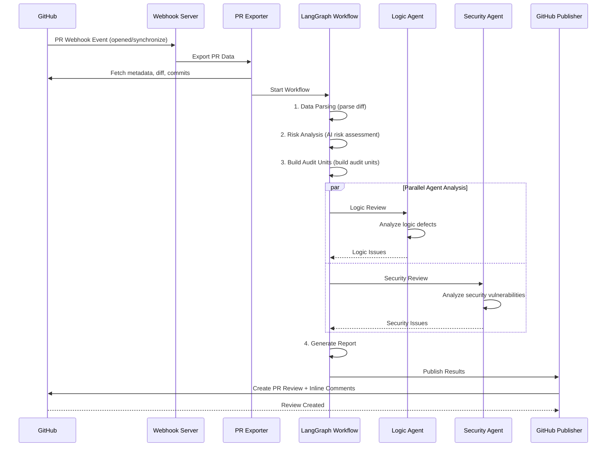

# 🦉 Wise Code Watchers

<p align="center">
  <strong>AI-Powered Multi-Agent PR Code Review System</strong>
</p>


<p align="center">
  
  
  
  
</p>


---

## 📖 Project Overview

**Wise Code Watchers** is an intelligent code review system built on LangGraph's multi-agent architecture. Running as a GitHub App, it automatically performs in-depth code reviews on Pull Requests. The system detects logic defects and security vulnerabilities, publishing review results as inline comments directly in GitHub PRs.

### ✨ Key Features

- 🤖 **Multi-Agent Collaboration Architecture**: LangGraph-based workflow engine with multiple specialized agents working in parallel
- 🔒 **Security Vulnerability Detection**: Professional Security Agent combined with Semgrep rules to detect security vulnerabilities
- 🧠 **Logic Defect Analysis**: Logic Agent performs deep analysis of code logic to uncover potential bugs
- 📊 **Intelligent Risk Assessment**: AI-driven risk scoring system prioritizes high-risk code for review
- 🔗 **Cross-File Analysis**: Analyzes the cross-file impact of code changes
- 💬 **Deep GitHub Integration**: Automatically posts inline comments to PRs with GitHub App Webhook support

---

## 🏗️ System Architecture

```
┌─────────────────────────────────────────────────────────────────────────────┐
│                              Wise Code Watchers                             │
├─────────────────────────────────────────────────────────────────────────────┤
│                                                                              │
│  ┌──────────────┐    ┌──────────────┐    ┌──────────────────────────────┐  │
│  │  GitHub App  │───▶│   Webhook    │───▶│       PR Exporter            │  │
│  │   Webhook    │    │   Handler    │    │  (metadata/diff/commits)     │  │
│  └──────────────┘    └──────────────┘    └──────────────────────────────┘  │
│                                                      │                       │
│                                                      ▼                       │
│  ┌───────────────────────────────────────────────────────────────────────┐  │
│  │                     LangGraph Workflow Engine                          │  │
│  │  ┌─────────────┐  ┌─────────────┐  ┌─────────────┐  ┌─────────────┐   │  │
│  │  │ Data Parse  │─▶│ Risk Analyze│─▶│  Triage    │─▶│  Parallel   │   │  │
│  │  │    Node     │  │    Node     │  │   Node      │  │  Analysis   │   │  │
│  │  └─────────────┘  └─────────────┘  └─────────────┘  └─────────────┘   │  │
│  │                                                            │           │  │
│  │                    ┌─────────────────────┬────────────────┘            │  │
│  │                    ▼                     ▼                               │  │
│  │            ┌──────────────┐      ┌──────────────┐                       │  │
│  │            │ Logic Agent  │      │Security Agent│                       │  │
│  │            │(Logic Review)│      │(Security Review)                     │  │
│  │            └──────────────┘      └──────────────┘                       │  │
│  │                    │                      │                               │  │
│  │                    └──────────┬───────────┘                               │  │
│  │                               ▼                                         │  │
│  │                    ┌──────────────────┐                                  │  │
│  │                    │ Report Generator │                                │  │
│  │                    └──────────────────┘                                │  │
│  └───────────────────────────────────────────────────────────────────────┘  │
│                                        │                                     │
│                                        ▼                                     │
│                         ┌──────────────────────────┐                        │
│                         │    GitHub Publisher      │                        │
│                         │  (PR Comments/Reviews)   │                        │
│                         └──────────────────────────┘                        │
└─────────────────────────────────────────────────────────────────────────────┘
```

---

## 📁 Project Structure

```
wise-code-watchers/
├── app.py                      # 🚀 Main entry point (Flask Webhook Server)
├── config.py                   # ⚙️ Configuration management
├── requirements.txt            # 📦 Python dependencies
├── Dockerfile                  # 🐳 Docker image configuration
├── docker-compose.yml          # 🐳 Docker Compose configuration
│
├── core/                       # 🔧 Core modules
│   ├── github_client.py        # GitHub API client
│   ├── git_client.py           # Git operations client
│   └── repo_manager.py         # Repository manager
│
├── agents/                     # 🤖 Agent modules
│   ├── base.py                 # Agent base class
│   ├── aggregator.py           # Result aggregator
│   ├── orchestrator.py         # Agent orchestrator
│   ├── issue_scoring_filter.py # Issue scoring filter
│   │
│   ├── preprocessing/          # Preprocessing modules
│   │   ├── diff_parser.py      # Diff parser
│   │   ├── description_analyzer.py # PR description analyzer
│   │   └── feature_divider.py  # Feature divider
│   │
│   ├── syntax/                 # Syntax analysis modules
│   │   ├── syntax_analysis_agent.py
│   │   ├── syntax_checker.py
│   │   ├── structure_agent.py
│   │   ├── memory_agent.py
│   │   └── prompts/            # Prompt templates
│   │
│   └── vulnerability/          # 🔒 Vulnerability detection module (core)
│       ├── logic_agent.py      # Logic defect agent
│       ├── security_agent.py   # Security vulnerability agent
│       └── src/
│           ├── main_workflow.py    # 🌟 LangGraph main workflow
│           ├── agents/
│           │   ├── logic_agent.py    # Enhanced logic agent
│           │   ├── security_agent.py # Enhanced security agent
│           │   └── triage_agent.py   # Triage agent
│           ├── analysis/           # Analysis engines
│           │   ├── risk_analyzer.py     # Risk analyzer
│           │   ├── cross_file_analyzer.py # Cross-file analyzer
│           │   ├── impact_analyzer.py   # Impact analyzer
│           │   └── security_validator.py # Security validator
│           ├── prompts/            # LLM prompts
│           ├── scripts/            # Utility scripts
│           │   ├── scanning/       # Scanning tools
│           │   ├── parsing/        # Parsing tools
│           │   └── todolist/       # TODO list generation
│           ├── mcpTools/           # MCP tools integration
│           └── semgrep_rules/      # Semgrep rule templates
│
├── tools/                      # 🛠️ External tools integration
│   ├── base.py                 # Tool base class
│   ├── linter.py               # Multi-language Linter
│   ├── security_scanner.py     # Security scanner
│   └── static_analyzer.py      # Static analyzer
│
├── knowledge/                  # 📚 Knowledge base
│   ├── base.py                 # Knowledge base base class
│   ├── vulnerability_kb.py     # Vulnerability knowledge base
│   ├── code_patterns_kb.py     # Code patterns knowledge base
│   └── best_practices_kb.py    # Best practices knowledge base
│
├── output/                     # 📊 Output modules
│   ├── models.py               # Data models
│   └── report_generator.py     # Report generator
│
├── export/                     # 📤 Export modules
│   └── pr_exporter.py          # PR data exporter
│
├── publish/                    # 📢 Publishing modules
│   └── github_publisher.py     # GitHub comment publisher
│
├── dev/                        # 🧪 Development/Testing
│   ├── architecture.md         # Architecture documentation
│   ├── test_workflow.py        # Workflow testing
│   └── test_hybrid_agent.py    # Agent testing
│
└── docs/                       # 📖 Documentation
    └── linter-installation.md  # Linter installation guide
```

---

## 🔄 Workflow

### Complete Review Process



### Workflow Node Details

| Node                   | Function                              | Input                    | Output            |
| ---------------------- | ------------------------------------- | ----------------------- | ----------------- |
| **Initialization**     | Initialize audit units, filter code   | PR directory            | Audit unit list   |
| **Data Parsing**       | Parse PR metadata and diff            | PR folder               | diff_ir, pr_data  |
| **Risk Analysis**      | AI-driven risk assessment             | diff_ir                 | feature_risk_plan |
| **Semgrep Scanning**   | Run security scanning rules           | Codebase                | semgrep_results   |
| **Logic Agent**        | Detect logic defects                  | Audit unit              | logic_review      |
| **Security Agent**     | Detect security vulnerabilities       | Audit unit + Semgrep evidence | security_review   |
| **Cross-File Analysis**| Analyze cross-file impact             | All analysis results    | cross_file_impact |
| **Report Generation**  | Generate final report                 | All analysis results    | final_report      |

---

## 🚀 Quick Start

### Requirements

- Python 3.12+
- Docker (recommended)
- GitHub App configuration

### 1. Clone the Project

```bash
git clone https://github.com/your-org/wise-code-watchers.git
cd wise-code-watchers
```

### 2. Install Dependencies

```bash
# Create virtual environment
python -m venv venv
source venv/bin/activate  # Linux/macOS
# venv\Scripts\activate  # Windows

# Install dependencies
pip install -r requirements.txt
```

### 3. Configure Environment Variables

Create a `.env` file:

```bash
# GitHub App Configuration
GITHUB_APP_ID=your_app_id
GITHUB_PRIVATE_KEY_PATH=/path/to/private-key.pem
GITHUB_WEBHOOK_SECRET=your_webhook_secret

# LLM Configuration
OPENAI_API_KEY=your_openai_api_key
# Or use OpenAI-compatible API
LLM_BASE_URL=https://api.example.com/v1
LLM_MODEL=gpt-4

# Service Configuration
PORT=3000

# Optional: Vulnerability detection thresholds
VULN_RISK_THRESHOLD_LOGIC=60
VULN_RISK_THRESHOLD_SECURITY=35
VULN_MAX_UNITS_LOGIC=12
VULN_MAX_UNITS_SECURITY=10
```

### 4. Run the Service

```bash
# Run directly
python app.py

# Or with Docker
docker-compose up -d
```

---

## ⚙️ Configuration

### Environment Variables

| Variable Name                | Required | Default  | Description                          |
| ---------------------------- | -------- | -------- | ------------------------------------ |
| `GITHUB_APP_ID`              | ✅        | -        | GitHub App ID                        |
| `GITHUB_PRIVATE_KEY_PATH`    | ✅        | -        | Private key file path                |
| `GITHUB_WEBHOOK_SECRET`      | ✅        | -        | Webhook secret                        |
| `OPENAI_API_KEY`             | ⚠️        | -        | OpenAI API Key                        |
| `LLM_BASE_URL`               | ❌        | -        | OpenAI-compatible API endpoint       |
| `LLM_MODEL`                  | ❌        | `GLM-4.6`| Model name                            |
| `PORT`                       | ❌        | `3000`   | Service port                          |
| `VULN_RISK_THRESHOLD_LOGIC`  | ❌        | `60`     | Logic review risk threshold           |
| `VULN_RISK_THRESHOLD_SECURITY`| ❌        | `35`     | Security review risk threshold        |

### GitHub App Configuration

1. Create a GitHub App:
   - Homepage URL: Your service address
   - Webhook URL: `https://your-domain.com/webhook`
   - Webhook Secret: Custom secret

2. Permission Configuration:
   - **Repository permissions**:
     - Contents: Read
     - Pull requests: Read and write
     - Metadata: Read
   - **Subscribe to events**:
     - Pull request

3. Generate and download the private key file

---

## 🔌 API Endpoints

### Webhook Endpoint

```
POST /webhook
```

Receives GitHub Webhook events. Supported events:

- `ping`: Health check
- `pull_request`: PR events (opened, synchronize, reopened)

### Health Check

```
GET /health
```

Returns service status.

---

## 🤖 Agents Details

### Logic Agent

**Responsibility**: Detect logic errors introduced or modified by PR diff

**Detection Types**:

- Boundary condition errors
- Null/null pointer handling
- Resource leaks
- Concurrency issues
- Algorithm errors

### Security Agent

**Responsibility**: Detect security vulnerabilities based on tool evidence

**Detection Types**:

- SQL Injection (SQLi)
- Command Injection (RCE)
- Server-Side Request Forgery (SSRF)
- Cross-Site Scripting (XSS)
- Insecure Deserialization
- Sensitive Information Leakage
- Authentication/Authorization Flaws

**Evidence-First Mechanism**:

1. `entrypoint_evidence`: External input sources
2. `call_chain_evidence`: Call chain analysis
3. `framework_evidence`: Framework auto-exposure
4. `context_evidence`: Contextual associations

### Triage Agent

**Responsibility**: Fast pre-screening to determine review priority

**Priorities**:

- P0: Urgent (high-risk security issues)
- P1: High (important logic issues)
- P2: Medium (general issues)
- P3: Low (minor issues)
- SKIP: Skip (tests/docs, etc.)

---

## 🔧 Tools Integration

### Linter Integration

Supported Linters:

| Language              | Tool                 | Detection Capabilities                      |
| --------------------- | -------------------- | ------------------------------------------- |
| Python                | Ruff                 | Code style, resource management, type check |
| JavaScript/TypeScript | ESLint               | Syntax errors, unused variables, Hook deps  |
| Go                    | golangci-lint        | Resource cleanup, SQL checks, security      |
| Ruby                  | RuboCop              | Code style, resource management             |
| Java                  | Checkstyle, SpotBugs | Code style, Bug detection                   |

### Security Scanners

- **Bandit**: Python security scanning
- **Pattern Matching**: Generic security pattern detection
- **Semgrep**: Custom rule scanning

---

## 📊 Output Reports

### Report Structure

```json
{
  "logic_review": {
    "issues_found": 2,
    "issues": [
      {
        "result": "ISSUE",
        "issues": [
          {
            "title": "Null Pointer Dereference Risk",
            "severity": "high",
            "location": {
              "file": "src/main.py",
              "line_start": 42,
              "line_end": 45
            },
            "description": "...",
            "evidence": "..."
          }
        ]
      }
    ]
  },
  "security_review": {
    "issues_found": 1,
    "issues": [...]
  },
  "cross_file_impact": {...},
  "summary": {...}
}
```

### GitHub Comment Example

The system automatically posts to PRs:

- **Summary Comment**: Contains overall review results
- **Inline Comments**: Adds comments at specific problematic code lines

---

## 🧪 Development & Testing

### Running Tests

```bash
# Workflow test
python dev/test_workflow.py

# Agent test
python dev/test_hybrid_agent.py
```

### Local Debugging

```bash
# Enable detailed logging
export ENABLE_DETAILED_LOGS=true
python app.py
```

---

## 🤝 Contributing

1. Fork this repository
2. Create a feature branch: `git checkout -b feature/AmazingFeature`
3. Commit changes: `git commit -m 'Add some AmazingFeature'`
4. Push to branch: `git push origin feature/AmazingFeature`
5. Submit a Pull Request

---

## 📄 License

This project is licensed under the MIT License - see [LICENSE](LICENSE) file for details

---

## 🙏 Acknowledgments

- [LangChain](https://github.com/langchain-ai/langchain) - LLM application framework
- [LangGraph](https://github.com/langchain-ai/langgraph) - Multi-agent workflow
- [Semgrep](https://github.com/semgrep/semgrep) - Code scanning engine
- [PyGithub](https://github.com/PyGithub/PyGithub) - GitHub API client

---

<p align="center">
  <strong>Made with ❤️ by Wise Code Watchers Team</strong>
</p>

**[中文版 README](README_ZH.md)**
