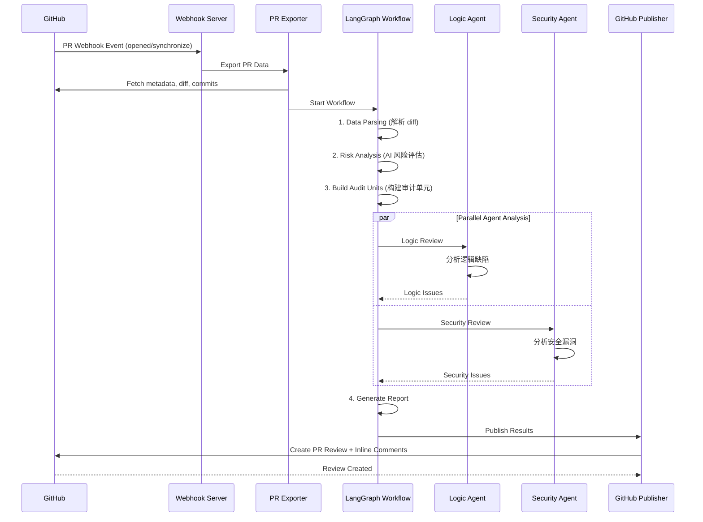

# 🦉 Wise Code Watchers

<p align="center">
  <strong>AI驱动的多Agent PR代码审查系统</strong>
</p>


<p align="center">
  
  
  
  
</p>


---

## 📖 项目简介

**Wise Code Watchers** 是一个基于 LangGraph 多 Agent 架构的智能代码审查系统，以 GitHub App 的形式运行，自动对 Pull Request 进行深度代码审查。系统能够自动检测逻辑缺陷、安全漏洞，并将审查结果以行内评论的形式发布到 GitHub PR 中。

### ✨ 核心特性

- 🤖 **多 Agent 协作架构**：基于 LangGraph 的工作流引擎，多个专业 Agent 并行协作
- 🔒 **安全漏洞检测**：专业的 Security Agent 结合 Semgrep 规则检测安全漏洞
- 🧠 **逻辑缺陷分析**：Logic Agent 深度分析代码逻辑，发现潜在 Bug
- 📊 **智能风险评估**：AI 驱动的风险评分系统，优先审查高风险代码
- 🔗 **跨文件分析**：分析代码变更的跨文件影响
- 💬 **GitHub 深度集成**：自动发布行内评论到 PR，支持 GitHub App Webhook
- 🗳️ **LLM 投票共识**：3个LLM并行分析，选择最佳结果，避免单点偏差
- 🛡️ **Nil-Guard 过滤器**：自动过滤 nil/NoMethodError 误报，提升报告质量

---

## 🏗️ 系统架构

```
┌─────────────────────────────────────────────────────────────────────────────┐
│                              Wise Code Watchers                             │
├─────────────────────────────────────────────────────────────────────────────┤
│                                                                              │
│  ┌──────────────┐    ┌──────────────┐    ┌──────────────────────────────┐  │
│  │  GitHub App  │───▶│   Webhook    │───▶│       PR Exporter            │  │
│  │   Webhook    │    │   Handler    │    │  (metadata/diff/commits)     │  │
│  └──────────────┘    └──────────────┘    └──────────────────────────────┘  │
│                                                      │                       │
│                                                      ▼                       │
│  ┌───────────────────────────────────────────────────────────────────────┐  │
│  │                     LangGraph Workflow Engine                          │  │
│  │  ┌─────────────┐  ┌─────────────┐  ┌─────────────┐  ┌─────────────┐   │  │
│  │  │ Data Parse  │─▶│ Risk Analyze│─▶│  Triage    │─▶│  Parallel   │   │  │
│  │  │    Node     │  │    Node     │  │   Node      │  │  Analysis   │   │  │
│  │  └─────────────┘  └─────────────┘  └─────────────┘  └─────────────┘   │  │
│  │                                                            │           │  │
│  │                    ┌─────────────────────┬────────────────┘            │  │
│  │                    ▼                     ▼                               │  │
│  │            ┌──────────────┐      ┌──────────────┐                       │  │
│  │            │ Logic Agent  │      │Security Agent│                       │  │
│  │            │  (缺陷检测)  │      │  (漏洞检测)  │                       │  │
│  │            └──────────────┘      └──────────────┘                       │  │
│  │                    │                      │                               │  │
│  │                    └──────────┬───────────┘                               │  │
│  │                               ▼                                         │  │
│  │                    ┌──────────────────┐                                  │  │
│  │                    │ Report Generator │                                │  │
│  │                    └──────────────────┘                                │  │
│  └───────────────────────────────────────────────────────────────────────┘  │
│                                        │                                     │
│                                        ▼                                     │
│                         ┌──────────────────────────┐                        │
│                         │    GitHub Publisher      │                        │
│                         │  (PR Comments/Reviews)   │                        │
│                         └──────────────────────────┘                        │
└─────────────────────────────────────────────────────────────────────────────┘
```

---

## 📁 项目结构

```
wise-code-watchers/
├── app.py                      # 🚀 主应用入口 (Flask Webhook Server)
├── config.py                   # ⚙️ 配置管理
├── backup.py                   # 💾 备份脚本
├── scan_pr_with_templates.py   # 🔍 PR 扫描脚本
├── requirements.txt            # 📦 Python 依赖
├── Dockerfile                  # 🐳 Docker 镜像配置
├── docker-compose.yml          # 🐳 Docker Compose 配置
├── .env.example                # 🔐 环境变量示例
├── linter-installation.md      # 📖 Linter 安装指南
├── CONTRIBUTING.md             # 🤝 贡献指南
├── CONTRIBUTORS.md             # 👥 贡献者列表
│
├── core/                       # 🔧 核心模块
│   ├── github_client.py        # GitHub API 客户端
│   ├── git_client.py           # Git 操作客户端
│   └── repo_manager.py         # 仓库管理器
│
├── agents/                     # 🤖 Agent 模块
│   ├── __init__.py
│   ├── base.py                 # Agent 基类
│   ├── orchestrator.py         # Agent 编排器
│   ├── summary_agent.py        # 总结 Agent
│   │
│   ├── preprocessing/          # 预处理模块
│   │   ├── diff_parser.py      # Diff 解析器
│   │   ├── description_analyzer.py # PR 描述分析
│   │   └── feature_divider.py  # 功能特性分割
│   │
│   ├── syntax/                 # 语法分析模块
│   │   ├── syntax_analysis_agent.py  # 语法分析 Agent
│   │   ├── syntax_checker.py         # 语法检查器
│   │   ├── structure_agent.py        # 结构分析 Agent
│   │   ├── memory_agent.py           # 记忆 Agent
│   │   ├── issue_filter.py           # Issue 过滤器
│   │   ├── core_rules.py             # 核心规则
│   │   ├── schemas.py                # 数据模式
│   │   └── prompts/                  # 提示词模板
│   │       ├── base.py
│   │       ├── python_prompt.py
│   │       ├── java_prompt.py
│   │       ├── go_prompt.py
│   │       ├── ruby_prompt.py
│   │       └── typescript_prompt.py
│   │
│   └── vulnerability/          # 🔒 漏洞检测模块 (核心)
│       └── src/
│           ├── main_workflow.py      # 🌟 LangGraph 主工作流
│           │
│           ├── agents/               # Agent 实现
│           │   ├── logic_agent.py    # 逻辑缺陷 Agent
│           │   ├── security_agent.py # 安全漏洞 Agent
│           │   └── triage_agent.py   # 分类预筛 Agent
│           │
│           ├── analysis/             # 分析引擎
│           │   ├── risk_analyzer.py       # 风险分析
│           │   ├── cross_file_analyzer.py # 跨文件分析
│           │   ├── impact_analyzer.py     # 影响分析
│           │   ├── security_validator.py  # 安全验证
│           │   └── hunk_index.py          # Hunk 索引
│           │
│           ├── scripts/             # 辅助脚本
│           │   ├── core/
│           │   │   ├── code_tools.py       # 代码工具
│           │   │   ├── context_builder.py  # 上下文构建
│           │   │   └── types.py            # 类型定义
│           │   ├── parsing/
│           │   │   ├── data_parser.py      # 数据解析
│           │   │   └── diff_slicer.py      # Diff 切片
│           │   ├── scanning/
│           │   │   ├── parallel_semgrep_scanner.py    # 并行 Semgrep 扫描
│           │   │   ├── template_semgrep_scanner.py    # 模板 Semgrep 扫描
│           │   │   ├── scan_task_planner.py           # 扫描任务规划
│           │   │   └── security_tooling.py            # 安全工具
│           │   ├── reporting/
│           │   │   └── final_report_generator.py      # 最终报告生成
│           │   ├── todolist/
│           │   │   ├── todolist_generator.py          # TODO 列表生成
│           │   │   └── todolist_executor.py           # TODO 列表执行
│           │   ├── analysis/
│           │   │   ├── initialization_engine.py       # 初始化引擎
│           │   │   └── vulnerability_analyzer.py      # 漏洞分析 (含 LLM 共识 & Nil-Guard)
│           │   └── smart_context_builder.py           # 智能上下文构建
│           │
│           ├── prompts/             # LLM 提示词
│           │   ├── __init__.py
│           │   ├── prompt.py                  # 主要提示词
│           │   ├── schema_validator.py         # JSON schema 验证器
│           │   ├── markdown_renderer.py        # JSON 转 Markdown 转换器
│           │   ├── structured_output_helper.py # 结构化输出集成
│           │   └── report_schema.json           # JSON schema
│           │
│           ├── mcpTools/           # MCP 工具集成
│           │   └── mcpTools.py
│           │
│           └── semgrep_rules/      # Semgrep 规则模板 (36+ 模板)
│               └── templates/
│                   ├── c_*.template.yaml              # C 语言规则
│                   ├── go_*.template.yaml             # Go 语言规则
│                   ├── java_*.template.yaml           # Java 语言规则
│                   ├── py_*.template.yaml             # Python 语言规则
│                   ├── rb_*.template.yaml             # Ruby 语言规则
│                   └── ts_*.template.yaml             # TypeScript 语言规则
│
├── tools/                      # 🛠️ 外部工具集成
│   ├── base.py                 # 工具基类
│   ├── linter.py               # 多语言 Linter (Ruff, ESLint, golangci-lint, etc.)
│   ├── security_scanner.py     # 安全扫描器 (Bandit, 模式匹配)
│   └── static_analyzer.py      # 静态分析器
│
├── knowledge/                  # 📚 知识库
│   ├── base.py                 # 知识库基类
│   ├── vulnerability_kb.py     # 漏洞知识库
│   ├── code_patterns_kb.py     # 代码模式库
│   └── best_practices_kb.py    # 最佳实践库
│
├── output/                     # 📊 输出模块
│   ├── models.py               # 数据模型
│   └── report_generator.py     # 报告生成器
│
├── export/                     # 📤 导出模块
│   └── pr_exporter.py          # PR 数据导出 (metadata, diff, commits)
│
├── publish/                    # 📢 发布模块
│   └── github_publisher.py     # GitHub 评论/Review 发布
│
├── dev/                        # 🧪 开发/测试
│   ├── architecture.md         # 架构文档
│   ├── test_workflow.py        # 工作流测试
│   └── test_hybrid_agent.py    # Agent 测试
│
├── pr_export/                  # 📦 PR 导出数据缓存
│   └── Wise-Code-Watchers_*_PR*/
│
├── workspace/                  # 💼 工作区 (代码仓库克隆目录)
│   └── discourse-wcw/          # 示例: Discourse 项目
│
└── secret/                     # 🔐 密钥存储
```

---


## 🚀 快速开始

### 环境要求

- Python 3.12+
- Docker (推荐)
- GitHub App 配置

### 1. 克隆项目

```bash
git clone https://github.com/your-org/wise-code-watchers.git
cd wise-code-watchers
```

### 2. 安装依赖

```bash
# 创建虚拟环境
python -m venv venv
source venv/bin/activate  # Linux/macOS
# venv\Scripts\activate  # Windows

# 安装依赖
pip install -r requirements.txt
```

### 3. 配置环境变量

创建 `.env` 文件：

```bash
# GitHub App 配置
GITHUB_APP_ID=your_app_id
GITHUB_PRIVATE_KEY_PATH=/path/to/private-key.pem
GITHUB_WEBHOOK_SECRET=your_webhook_secret

# LLM 配置
BASE_URL=https://api.openai.com/v1
OPENAI_API_KEY=your_openai_api_key
MODEL=gpt-4

# 服务配置
PORT=3000

# 可选：监控的仓库列表 (为空或 * 表示监控所有)
MONITORED_REPOS=repo1,repo2,repo3
```

### 4. 运行服务

```bash
# 直接运行
python app.py

# 或使用 Docker
docker-compose up -d
```

---

## ⚙️ 配置说明

### 环境变量

| 变量名                         | 必需 | 默认值      | 说明                                    |
| ------------------------------ | ---- | ----------- | --------------------------------------- |
| `GITHUB_APP_ID`                | ✅    | -           | GitHub App ID                           |
| `GITHUB_PRIVATE_KEY_PATH`      | ✅    | -           | 私钥文件路径                            |
| `GITHUB_WEBHOOK_SECRET`        | ✅    | -           | Webhook 密钥                            |
| `BASE_URL`                     | ⚠️    | -           | LLM API 基础 URL (兼容 OpenAI)          |
| `OPENAI_API_KEY`               | ⚠️    | -           | OpenAI API Key                          |
| `MODEL`                        | ❌    | `GLM-4.6`   | 模型名称                                |
| `PORT`                         | ❌    | `3000`      | 服务端口                                |
| `MONITORED_REPOS`              | ❌    | `*` (全部)  | 监控的仓库名称列表,逗号分隔 (如 `repo1,repo2`)。为空或 `*` 表示监控所有安装了此 GitHub App 的仓库 |

### GitHub App 配置

1. 创建 GitHub App：
   - Homepage URL: 你的服务地址
   - Webhook URL: `https://your-domain.com/webhook`
   - Webhook Secret: 自定义密钥

2. 权限配置：
   - **Repository permissions**:
     - Contents: Read
     - Pull requests: Read and write
     - Metadata: Read
   - **Subscribe to events**:
     - Pull request

3. 生成并下载私钥文件

---

## 🔌 API 端点

### Webhook 端点

```
POST /webhook
```

接收 GitHub Webhook 事件。支持的事件：

- `ping`: 健康检查
- `pull_request`: PR 事件 (opened, synchronize, reopened)

### 健康检查

```
GET /health
```

返回服务状态。

---

## 🔄 工作流程

### 完整审查流程



### 工作流节点详解

| 节点                    | 功能                                 | 输入                    | 输出              |
| ----------------------- | ------------------------------------ | ----------------------- | ----------------- |
| **Initialization**      | 初始化审计单元，过滤不需要审查的代码 | PR 目录                 | 审计单元列表      |
| **Data Parsing**        | 解析 PR 元数据和 diff                | PR 文件夹               | diff_ir, pr_data  |
| **Risk Analysis**       | AI 驱动的风险评估                    | diff_ir                 | feature_risk_plan |
| **Semgrep Scanning**    | 运行安全扫描规则                     | 代码库                  | semgrep_results   |
| **Logic Agent**         | 检测逻辑缺陷                         | 审计单元                | logic_review      |
| **Security Agent**      | 检测安全漏洞                         | 审计单元 + Semgrep 证据 | security_review   |
| **Cross-File Analysis** | 分析跨文件影响                       | 所有分析结果            | cross_file_impact |
| **Report Generation**   | 生成最终报告                         | 所有分析结果            | final_report      |

---

## 🤖 Agent 详解

### Logic Agent

**职责**：检测由 PR diff 引入或修改导致的逻辑错误

**检测类型**：

- 边界条件错误
- 空值/空指针处理
- 资源泄漏
- 并发问题
- 算法错误

**Semgrep 证据增强** 🆕：

Logic Agent 现在支持 Semgrep 静态分析证据增强，与 Security Agent 使用相同的证据注入机制：

1. **证据匹配**：按文件路径和行号范围精确匹配 Semgrep 发现
2. **提示词增强**：将匹配的 Semgrep 发现注入到 LLM 提示词中
3. **模式参考**：静态分析结果作为代码模式参考，辅助逻辑缺陷检测
4. **并行执行**：与 Security Agent 并行处理，同时接收 Semgrep 证据

**数据流**：

```
Semgrep 扫描 (all_evidence.json)
    ↓
按功能块匹配证据
    ↓
注入 Logic Agent 提示词
    ↓
增强的逻辑缺陷检测
```

### Security Agent

**职责**：基于工具证据检测安全漏洞

**检测类型**：

- SQL 注入 (SQLi)
- 命令注入 (RCE)
- 服务端请求伪造 (SSRF)
- 跨站脚本 (XSS)
- 不安全的反序列化
- 敏感信息泄露
- 认证/授权缺陷

**证据先行机制**：

1. `entrypoint_evidence`: 外部输入来源
2. `call_chain_evidence`: 调用链分析
3. `framework_evidence`: 框架自动暴露
4. `context_evidence`: 上下文关联

### Triage Agent

**职责**：快速预筛选，确定审查优先级

**优先级**：

- P0: 紧急 (高风险安全问题)
- P1: 高 (重要逻辑问题)
- P2: 中 (一般问题)
- P3: 低 (轻微问题)
- SKIP: 跳过 (测试/文档等)

### Issue Scoring Filter

**职责**：基于 LLM 的智能问题评分和过滤系统

**功能**：对所有 Agent 发现的问题进行三维评分和智能过滤

**评分维度**：

1. **相关性 (relevance_score)**: 问题与 PR 变更的关系 (0.0-1.0)
   - `1.0` = 直接在变更代码中，由本次 PR 引入
   - `0.7` = 在变更文件中，可能受影响
   - `0.4` = 在相关代码中，可能有关联
   - `0.1` = 在未变更代码中，与 PR 无关

2. **严重性 (severity_score)**: 问题的严重程度 (0.0-1.0)
   - `1.0` = 关键 - 安全漏洞、崩溃、数据丢失
   - `0.8` = 高 - 重要 Bug、逻辑错误、资源泄漏
   - `0.5` = 中 - 应该修复但不紧急
   - `0.2` = 低 - 次要改进、风格问题

3. **置信度 (confidence_score)**: 评估的可信度 (0.0-1.0)
   - `1.0` = 非常确定，有明确证据
   - `0.5` = 中等确定
   - `0.2` = 不确定，需要更多上下文

**过滤规则**：

- 同时满足：`relevance >= 0.5` AND `severity >= 0.4` AND `confidence >= 0.3`
- 特别处理：测试文件问题 → 低相关性，生产代码漏洞 → 高严重性

**工作流程**：

```
所有 Agent 发现的问题
    ↓
LLM 三维评分 (相关性/严重性/置信度)
    ↓
根据阈值过滤
    ↓
输出高质量问题列表到 GitHub
```

---

## 🔧 工具集成

### Linter 集成

支持的 Linter：

| 语言                  | 工具                 | 检测能力                        |
| --------------------- | -------------------- | -------------------------------|
| Python                | Ruff                 | 代码风格、资源管理、类型检查     |
| JavaScript/TypeScript | ESLint               | 语法错误、未使用变量、Hook 依赖  |
| Go                    | golangci-lint        | 资源关闭、SQL 检查、安全问题     |
| Ruby                  | RuboCop              | 代码风格、资源管理               |
| Java                  | Checkstyle, SpotBugs | 代码风格、Bug 检测              |

### 安全扫描器

- **Bandit**: Python 安全扫描
- **模式匹配扫描**: 通用安全模式检测
- **Semgrep**: 自定义规则扫描

---

## 📊 输出报告

### 报告结构

```json
{
  "logic_review": {
    "issues_found": 2,
    "issues": [
      {
        "result": "ISSUE",
        "issues": [
          {
            "title": "空指针解引用风险",
            "severity": "high",
            "location": {
              "file": "src/main.py",
              "line_start": 42,
              "line_end": 45
            },
            "description": "...",
            "evidence": "..."
          }
        ]
      }
    ]
  },
  "security_review": {
    "issues_found": 1,
    "issues": [...]
  },
  "cross_file_impact": {...},
  "summary": {...}
}
```

### GitHub 评论示例

系统会自动在 PR 中发布：

- **总结评论**：包含整体审查结果
- **行内评论**：在具体问题代码行添加评论

---

## 🧪 开发与测试

### 运行测试

```bash
# 工作流测试
python dev/test_workflow.py

# Agent 测试
python dev/test_hybrid_agent.py
```

### 本地调试

```bash
# 启用详细日志
export ENABLE_DETAILED_LOGS=true
python app.py
```

---

## 🤝 贡献指南

1. Fork 本仓库
2. 创建特性分支：`git checkout -b feature/AmazingFeature`
3. 提交更改：`git commit -m 'Add some AmazingFeature'`
4. 推送分支：`git push origin feature/AmazingFeature`
5. 提交 Pull Request

---

## 📄 许可证

本项目采用 MIT 许可证 - 详见 [LICENSE](LICENSE) 文件

---

## 🙏 致谢

- [LangChain](https://github.com/langchain-ai/langchain) - LLM 应用框架
- [LangGraph](https://github.com/langchain-ai/langgraph) - 多 Agent 工作流
- [Semgrep](https://github.com/semgrep/semgrep) - 代码扫描引擎
- [PyGithub](https://github.com/PyGithub/PyGithub) - GitHub API 客户端

---

<p align="center">
  <strong>Made with ❤️ by Wise Code Watchers Team</strong>
</p>

**[English Version](README.md)**
