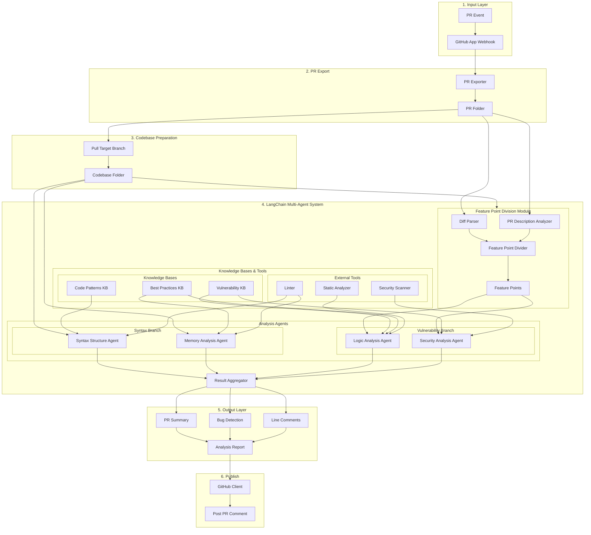
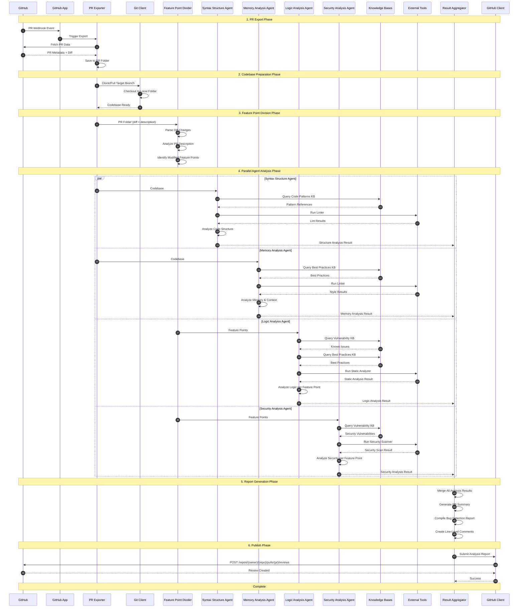

# Multi-Agent PR Review System Architecture

## Flowchart



## Sequence Diagram



## Agent Responsibilities

| Component | Role | Input | Output |
|-----------|------|-------|--------|
| **Feature Point Divider** | Identifies modified functional points from PR | Diff files, PR description | Feature Points List |
| **Syntax Structure Agent** | Analyzes code structure, AST, and syntax correctness | Codebase, Code Patterns KB, Linter | Structure Analysis Result |
| **Memory Analysis Agent** | Analyzes code context, variable lifecycle, and memory patterns | Codebase, Best Practices KB, Linter | Memory Analysis Result |
| **Logic Analysis Agent** | Detects logic errors, edge cases, and algorithmic bugs | Feature Points, Vulnerability KB, Static Analyzer | Logic Analysis Result |
| **Security Analysis Agent** | Identifies security vulnerabilities and unsafe code | Feature Points, Vulnerability KB, Security Scanner | Security Analysis Result |
| **Result Aggregator** | Merges all agent outputs and generates final report | All 4 agent outputs | Final Analysis Report |

## Knowledge Bases & External Tools

| Type | Name | Purpose |
|------|------|---------|
| **Knowledge Base** | Code Patterns KB | Common coding patterns and anti-patterns |
| **Knowledge Base** | Vulnerability KB | Known vulnerabilities, CVEs, security issues |
| **Knowledge Base** | Best Practices KB | Language/framework best practices |
| **External Tool** | Static Analyzer | Deep code analysis (e.g., Semgrep, CodeQL) |
| **External Tool** | Linter | Syntax and style checking (e.g., ESLint, Pylint) |
| **External Tool** | Security Scanner | Security vulnerability scanning (e.g., Snyk, Bandit) |

## Report Structure

```json
{
  "pr_summary": {
    "title": "string",
    "description": "string",
    "files_changed": ["list"],
    "summary": "AI-generated summary"
  },
  "bug_detection": {
    "has_bugs": "boolean",
    "bugs": [
      {
        "severity": "high|medium|low",
        "type": "string",
        "description": "string",
        "file": "string",
        "line": "number"
      }
    ]
  },
  "line_comments": [
    {
      "path": "string",
      "line": "number",
      "body": "string",
      "side": "RIGHT"
    }
  ]
}
```
